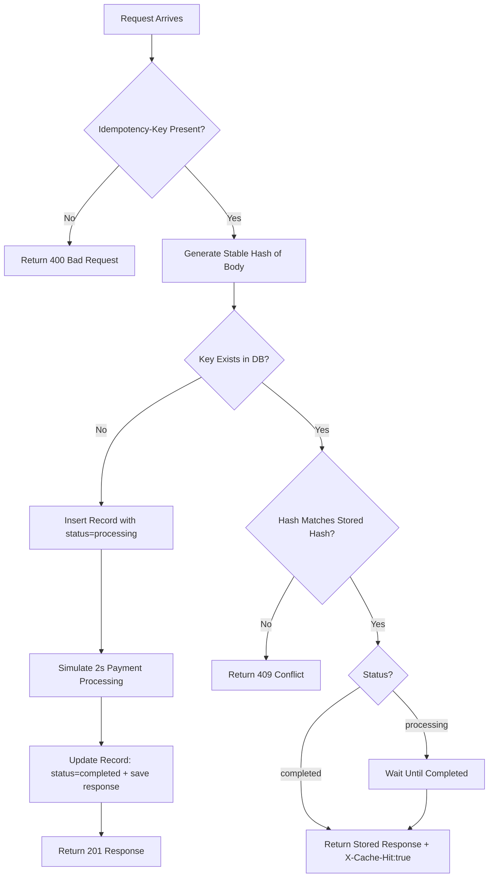

## Architecture Flow

```mermaid
flowchart TD
    A[Request Arrives] --> B{Idempotency-Key Present?}
    B -- No --> C[Return 400 Bad Request]
    B -- Yes --> D[Generate Stable Hash of Body]
    D --> E{Key Exists in DB?}

    E -- No --> F[Insert Record with status=processing]
    F --> G[Simulate 2s Payment Processing]
    G --> H[Update Record: status=completed + save response]
    H --> I[Return 201 Response]

    E -- Yes --> J{Hash Matches Stored Hash?}
    J -- No --> K[Return 409 Conflict]

    J -- Yes --> L{Status?}
    L -- completed --> M[Return Stored Response + X-Cache-Hit:true]
    L -- processing --> N[Wait Until Completed]
    N --> M
```