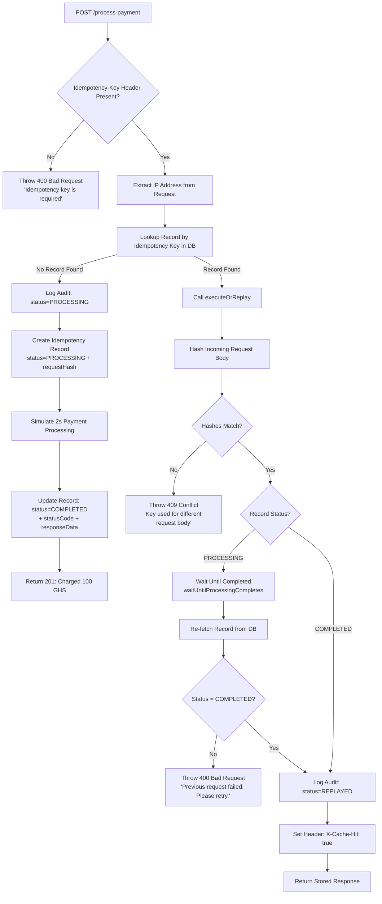

# Idempotency Gateway — Pay-Once Protocol

A NestJS-based idempotency layer that ensures payment requests are processed **exactly once**, regardless of how many times a client retries.

---

## 1. Architecture Diagram


---

## 2. Setup Instructions

### Prerequisites

- Node.js v18+
- npm or yarn
- MongoDB (local or Atlas URI)

### Installation
```bash
git clone https://github.com/your-username/your-repo-name.git
cd idempotency-gateway
npm install
```

### Environment Variables

Create a `.env` file in the root directory, example:
```env
# make sure ip access list has 0.0.0.0/0 for localhost
MONGODB_URI=mongodb://localhost:27017/idempotency-gateway
```

### Running the App
```bash
# Development mode
npm run start:dev

# Production mode
npm run build
npm run start:prod
```

### Running Tests
```bash
# Run all unit tests
npm run test

# Run tests with coverage report
npm run test:cov

# Run end-to-end tests
npm run test:e2e
```

---

## 3. API Documentation

### Base URL
```
http://localhost:3000
```

### POST `/process-payment`

Processes a payment. If the same `Idempotency-Key` is sent again with the same body, the original response is returned without reprocessing.

#### Request Headers

| Header | Required | Description |
|---|---|---|
| `Idempotency-Key` | ✅ Yes | A unique string identifying this request |
| `Content-Type` | ✅ Yes | `application/json` |

#### Request Body
```json
{
  "amount": 100,
  "currency": "GHS"
}
```

| Field | Type | Required | Description |
|---|---|---|---|
| `amount` | number | ✅ Yes | Payment amount |
| `currency` | string | ✅ Yes | Currency code (e.g. GHS) |

---

#### Scenario 1 — First Request (Happy Path)

No record exists for the key. An audit log entry is created with `status=PROCESSING`, the idempotency record is saved, payment is simulated (2s delay), the record is updated to `COMPLETED`, and the response is returned.
```http
POST /process-payment
Idempotency-Key: txn_abc_001
Content-Type: application/json

{
  "amount": 100,
  "currency": "GHS"
}
```

**Response `201 Created`:**
```json
{
  "success": true,
  "message": "Charged 100 GHS"
}
```

---

#### Scenario 2 — Duplicate Request (Cache Hit)

A record already exists with a matching hash and `status=COMPLETED`. The stored response is returned immediately with no reprocessing. An audit log entry is created with `status=REPLAYED`.
```http
POST /process-payment
Idempotency-Key: txn_abc_001
Content-Type: application/json

{
  "amount": 100,
  "currency": "GHS"
}
```

**Response `200 OK`:**
```json
{
  "success": true,
  "message": "Payment processed successfully"
}
```

**Response Header:**
```
X-Cache-Hit: true
```

---

#### Scenario 3 — Same Key, Different Body (Conflict)

A record exists for the key but the hash of the incoming body does not match the stored hash.
```http
POST /process-payment
Idempotency-Key: txn_abc_001
Content-Type: application/json

{
  "amount": 500,
  "currency": "GHS"
}
```

**Response `409 Conflict`:**
```json
{
  "statusCode": 409,
  "message": "Idempotency key already used for a different request body."
}
```

---

#### Scenario 4 — Missing Idempotency Key

Request arrives without the `Idempotency-Key` header.

**Response `400 Bad Request`:**
```json
{
  "statusCode": 400,
  "message": "Idempotency key is required"
}
```

---

#### Scenario 5 — In-Flight Race Condition

A duplicate request arrives while the original is still processing (`status=PROCESSING`). The duplicate calls `waitUntilProcessingCompletes`, re-fetches the record once done, and returns the completed result. An audit log entry is created with `status=REPLAYED`.

**Response `200 OK`:**
```json
{
  "success": true,
  "message": "Payment processed successfully"
}
```

**Response Header:**
```
X-Cache-Hit: true
```

---

## 4. Design Decisions

### NestJS as the Framework

NestJS was chosen for its opinionated, scalable architecture that enforces separation of concerns out of the box. For a fintech use case where correctness and maintainability matter, NestJS's module system, dependency injection, and built-in support for decorators and guards makes the codebase easier to extend and audit. It also has strong TypeScript support, which reduces runtime errors in critical payment logic.

### MongoDB as the Database

MongoDB was chosen as the persistence layer for the idempotency store for several reasons:

- **Speed**: MongoDB's document model means a single read or write fetches the entire idempotency record (key, hash, status, response) in one operation — no joins needed.
- **Flexible Schema**: Payment response payloads can vary in structure. Storing them as documents avoids the overhead of a rigid relational schema.
- **TTL Indexes**: MongoDB natively supports TTL (Time-To-Live) indexes, which can automatically expire old idempotency records after a set period (e.g., 24 hours) — a common requirement in real-world fintech systems.
- **Atomic Operations**: MongoDB's `findOneAndUpdate` with upsert semantics allows safely inserting a new record or detecting an existing one in a single atomic operation, reducing the risk of race conditions.

### Modular Approach

The project is structured using NestJS modules, separating concerns into distinct layers: the `PaymentModule` handles HTTP request handling and business logic, the `IdempotencyModule` manages key lookup, hash comparison, record creation and the in-flight wait mechanism, the `AuditModule` handles all audit logging independently, and shared utilities such as body hashing live in a `SharedModule`. This modular design means the idempotency layer is reusable — it can be plugged into any other endpoint (e.g., refunds, transfers) without duplicating logic. It also makes each layer independently testable without depending on the full application stack.

---

## 5. Developer's Choice

### Audit Log Entries


A dedicated `AuditService` is called on every request that passes through the payment gateway. Each audit log entry captures:

- The `Idempotency-Key` used
- The full request body
- The response body (where available)
- The outcome status: `PROCESSING`, or `REPLAYED`
- The client IP address (extracted from `req.ip` or `x-forwarded-for`)
- A timestamp

### Why This Matters in a Real-World Fintech Company

In payments, **observability is not optional — it is a compliance requirement**. Audit logs serve several critical purposes:

1. **Fraud Investigation**: If a merchant disputes a double charge, the audit log provides an immutable, timestamped record of every request received and how it was handled. You can prove definitively whether a duplicate was replayed or a new charge was triggered.

2. **Regulatory Compliance**: Financial regulators (e.g., Bank of Ghana, PCI-DSS standards) require that payment systems maintain detailed records of all transaction attempts, not just successful ones. Audit logs satisfy this without polluting the core payments database.

3. **Debugging & Incident Response**: When a client reports a failed retry, engineers can query audit logs by `Idempotency-Key` or IP address to see exactly what the server received, when, and what decision was made — without reconstructing state from scattered application logs.

4. **Detecting Abuse Patterns**: Repeated `409 Conflict` hits on the same key from different IP addresses could indicate a key-reuse attack. Because the IP address is captured on every log entry, these patterns can be detected and alerted on over time.
